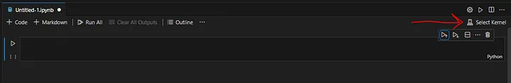
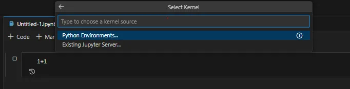

# Setup Jupyter Env

Reference tutorial:
> https://medium.com/@FredAsDev/connect-vs-code-jupyter-notebook-to-a-jupyter-container-a63293f29325

1. Build docker container locally

```
./run_dev.sh
```

2. Connect vscode to running Jupyter server
    * Control+Shift+P to open vscode command box. Choose Create: New Jupyter Notebook
    * connect with http://127.0.0.1:8888
        * 
    * Select Python Kernel
        * 

3. 🎉Happy coding🎉

